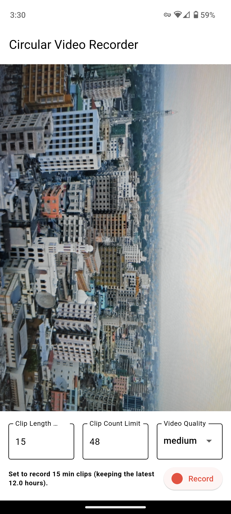
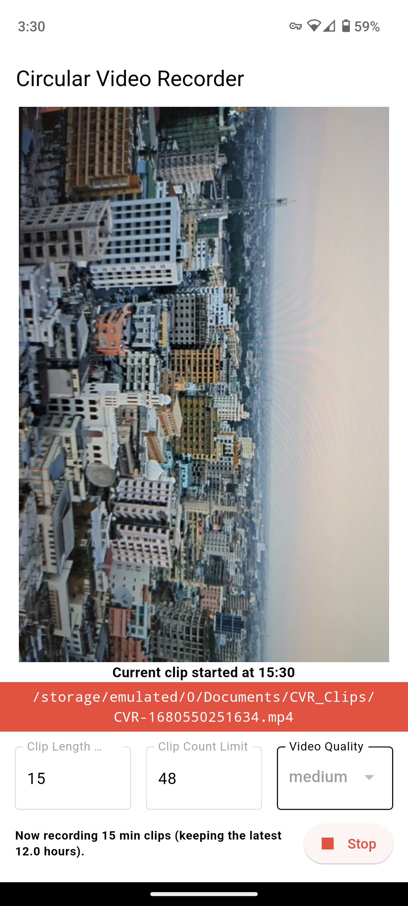
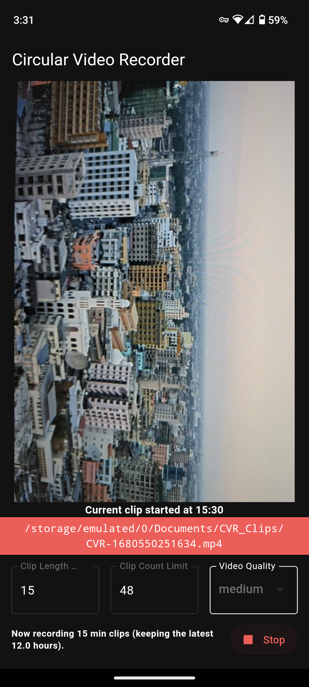

# Circular Video Recorder

Continuously record video in small clips.

Options:
- Clip count limit to avoid running out of storage space.
- Server to make the clips available for download on the local network. 

Note: Clips are saved to the App's internal storage so that they can automatically be deleted when the user-specified limit is reached. This internal Clip storage is not accessible via Gallery apps, and is cleared when the App is uninstalled. A button is provided to move Clips to an external Gallery-accessible folder.

## Screenshots

